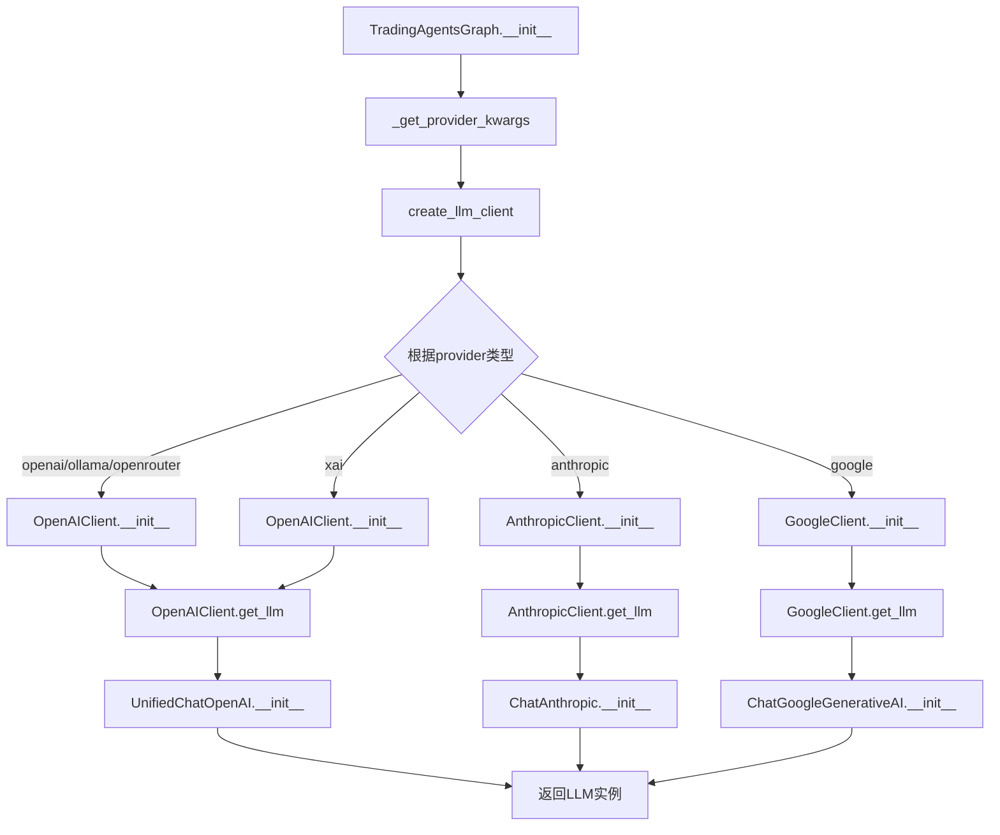
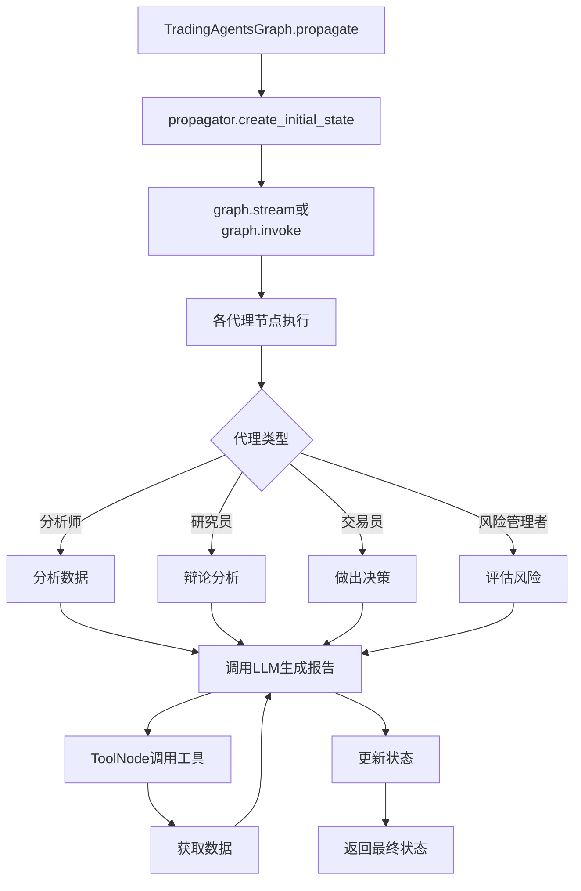

# LLM 相关的函数调用关系链

## 核心调用流程

### 1. LLM 客户端创建流程

### 2. LLM 使用流程

## 详细调用关系

### 1. TradingAgentsGraph 初始化

- **TradingAgentsGraph.__init__**
  - 调用 `_get_provider_kwargs()` 获取提供商特定参数
  - 调用 `create_llm_client()` 创建深度思考LLM客户端
  - 调用 `create_llm_client()` 创建快速思考LLM客户端
  - 调用客户端的 `get_llm()` 方法获取LLM实例
  - 将LLM实例传递给GraphSetup

### 2. LLM 客户端创建

- **create_llm_client** (factory.py)
  - 根据provider类型创建对应的客户端实例
  - 支持的provider: openai, anthropic, google, xai, ollama, openrouter

- **OpenAIClient.__init__**
  - 初始化OpenAI客户端配置

- **OpenAIClient.get_llm**
  - 根据provider设置不同的base_url
  - 获取环境变量中的API密钥
  - 创建并返回UnifiedChatOpenAI实例

- **UnifiedChatOpenAI.__init__**
  - 处理推理模型的特殊参数
  - 调用父类ChatOpenAI的初始化方法

### 3. 工具调用

- **TradingAgentsGraph._create_tool_nodes**
  - 创建不同类型的ToolNode
  - 每个ToolNode包含一组工具函数

- **ToolNode**
  - 由LangGraph提供
  - 负责执行工具函数并处理结果

- **工具函数**
  - get_stock_data: 获取股票数据
  - get_indicators: 获取技术指标
  - get_fundamentals: 获取基本面数据
  - get_balance_sheet: 获取资产负债表
  - get_cashflow: 获取现金流量表
  - get_income_statement: 获取损益表
  - get_news: 获取新闻数据
  - get_insider_transactions: 获取内幕交易数据
  - get_global_news: 获取全球新闻

### 4. 图执行

- **TradingAgentsGraph.propagate**
  - 创建初始状态
  - 执行图的stream或invoke方法
  - 处理最终状态并返回结果

- **GraphSetup.setup_graph**
  - 创建完整的代理通信图
  - 配置各个节点的LLM和工具

- **代理节点执行**
  - 每个代理使用分配的LLM进行推理
  - 根据需要调用工具获取数据
  - 生成分析报告或决策

## LLM 配置参数

### 1. 提供商特定参数

- **OpenAI**
  - reasoning_effort: 推理努力程度
  - temperature: 温度参数
  - top_p: 核采样参数

- **Google**
  - thinking_level: 思考级别

- **Anthropic**
  - temperature: 温度参数
  - top_p: 核采样参数

### 2. 通用参数

- **timeout**: 请求超时时间
- **max_retries**: 最大重试次数
- **callbacks**: 回调函数列表

## 数据流向

1. **输入数据**
   - 股票代码 (ticker)
   - 交易日期 (trade_date)

2. **数据获取**
   - 通过ToolNode调用各种工具函数
   - 从Alpha Vantage和Yahoo Finance获取数据

3. **数据处理**
   - 各分析师代理分析不同维度的数据
   - 生成分析报告

4. **决策制定**
   - 研究员团队进行辩论
   - 交易员做出交易决策
   - 风险管理团队评估风险

5. **输出结果**
   - 最终交易决策
   - 完整的状态日志

## 代码优化建议

1. **LLM 客户端抽象**
   - 当前的LLM客户端实现已经很好地抽象了不同提供商的差异
   - 建议添加更多提供商的支持，如Cohere、Mistral等

2. **工具调用优化**
   - 考虑添加缓存机制，减少重复的数据获取
   - 实现并行工具调用，提高性能

3. **错误处理**
   - 在LLM调用和工具调用中添加更robust的错误处理
   - 实现重试机制和降级策略

4. **监控和日志**
   - 添加更详细的LLM调用监控
   - 记录token使用情况和响应时间

5. **配置管理**
   - 考虑使用更结构化的配置管理方式
   - 支持不同环境的配置文件