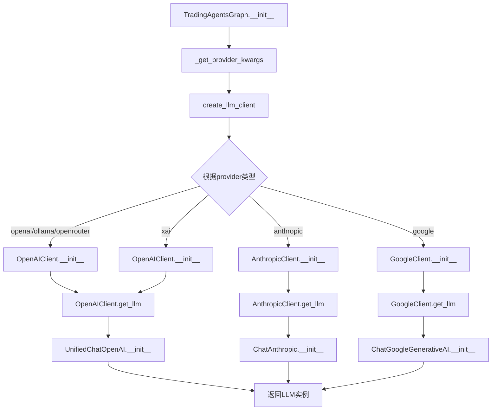
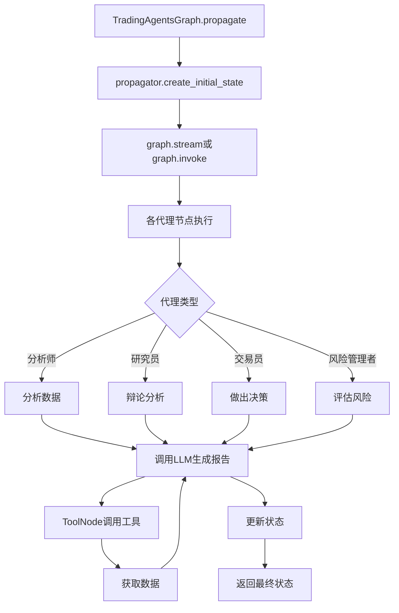

# LLM 相关的函数调用关系链

## 核心调用流程

### 1. LLM 客户端创建流程

```mermaid
flowchart TD
    A[TradingAgentsGraph.__init__] --> B[_get_provider_kwargs]
    B --> C[create_llm_client]
    C --> D{根据provider类型}
    D -->|openai/ollama/openrouter| E[OpenAIClient.__init__]
    D -->|xai| F[OpenAIClient.__init__]
    D -->|anthropic| G[AnthropicClient.__init__]
    D -->|google| H[GoogleClient.__init__]
    E --> I[OpenAIClient.get_llm]
    F --> I
    G --> J[AnthropicClient.get_llm]
    H --> K[GoogleClient.get_llm]
    I --> L[UnifiedChatOpenAI.__init__]
    J --> M[ChatAnthropic.__init__]
    K --> N[ChatGoogleGenerativeAI.__init__]
    L --> O[返回LLM实例]
    M --> O
    N --> O
```

### 2. LLM 使用流程

```mermaid
flowchart TD
    A[TradingAgentsGraph.propagate] --> B[propagator.create_initial_state]
    B --> C[graph.stream或graph.invoke]
    C --> D[各代理节点执行]
    D --> E{代理类型}
    E -->|分析师| F[分析数据]
    E -->|研究员| G[辩论分析]
    E -->|交易员| H[做出决策]
    E -->|风险管理者| I[评估风险]
    F --> J[调用LLM生成报告]
    G --> J
    H --> J
    I --> J
    J --> K[ToolNode调用工具]
    K --> L[获取数据]
    L --> J
    J --> M[更新状态]
    M --> N[返回最终状态]
```

## 详细调用关系

### 1. TradingAgentsGraph 初始化

- **TradingAgentsGraph.__init__**
  - 调用 `_get_provider_kwargs()` 获取提供商特定参数
  - 调用 `create_llm_client()` 创建深度思考LLM客户端
  - 调用 `create_llm_client()` 创建快速思考LLM客户端
  - 调用客户端的 `get_llm()` 方法获取LLM实例
  - 将LLM实例传递给GraphSetup

### 2. LLM 客户端创建

- **create_llm_client** (factory.py)
  - 根据provider类型创建对应的客户端实例
  - 支持的provider: openai, anthropic, google, xai, ollama, openrouter

- **OpenAIClient.__init__**
  - 初始化OpenAI客户端配置

- **OpenAIClient.get_llm**
  - 根据provider设置不同的base_url
  - 获取环境变量中的API密钥
  - 创建并返回UnifiedChatOpenAI实例

- **UnifiedChatOpenAI.__init__**
  - 处理推理模型的特殊参数
  - 调用父类ChatOpenAI的初始化方法

### 3. 工具调用

- **TradingAgentsGraph._create_tool_nodes**
  - 创建不同类型的ToolNode
  - 每个ToolNode包含一组工具函数

- **ToolNode**
  - 由LangGraph提供
  - 负责执行工具函数并处理结果

- **工具函数**
  - get_stock_data: 获取股票数据
  - get_indicators: 获取技术指标
  - get_fundamentals: 获取基本面数据
  - get_balance_sheet: 获取资产负债表
  - get_cashflow: 获取现金流量表
  - get_income_statement: 获取损益表
  - get_news: 获取新闻数据
  - get_insider_transactions: 获取内幕交易数据
  - get_global_news: 获取全球新闻

### 4. 图执行

- **TradingAgentsGraph.propagate**
  - 创建初始状态
  - 执行图的stream或invoke方法
  - 处理最终状态并返回结果

- **GraphSetup.setup_graph**
  - 创建完整的代理通信图
  - 配置各个节点的LLM和工具

- **代理节点执行**
  - 每个代理使用分配的LLM进行推理
  - 根据需要调用工具获取数据
  - 生成分析报告或决策

## LLM 配置参数

### 1. 提供商特定参数

- **OpenAI**
  - reasoning_effort: 推理努力程度
  - temperature: 温度参数
  - top_p: 核采样参数

- **Google**
  - thinking_level: 思考级别

- **Anthropic**
  - temperature: 温度参数
  - top_p: 核采样参数

### 2. 通用参数

- **timeout**: 请求超时时间
- **max_retries**: 最大重试次数
- **callbacks**: 回调函数列表

## 数据流向

1. **输入数据**
   - 股票代码 (ticker)
   - 交易日期 (trade_date)

2. **数据获取**
   - 通过ToolNode调用各种工具函数
   - 从 Alpha Vantage、Yahoo Finance、Longbridge 获取数据（通过 UnifiedDataManager 路由）

3. **数据处理**
   - 各分析师代理分析不同维度的数据
   - 生成分析报告

4. **决策制定**
   - 研究员团队进行 N-way round-robin 辩论（默认 Bull + Bear + Buffett，共 9 种可选）
   - 交易员做出交易决策
   - 风险管理团队评估风险

5. **输出结果**
   - 最终交易决策
   - 完整的状态日志

## 已完成的优化

1. **LLM 客户端抽象** ✅
   - 已实现 `BaseLLMClient` 抽象基类，支持 OpenAI、Anthropic、Google 等 6 种提供商
   - 通过 `create_llm_client()` 工厂函数统一创建

2. **工具调用优化** ✅
   - 已实现 `DataCache` 缓存机制，减少重复数据获取
   - 已实现 `LazyIndicatorCalculator` 按需计算指标（性能提升 60-80%）

3. **错误处理** ✅
   - 已实现 15+ 自定义异常类（`exceptions.py`）
   - 已实现重试策略（`MAX_RETRY_ATTEMPTS = 3`）

4. **监控和日志** ✅
   - 已实现统一日志系统（`utils/logger.py`），支持敏感信息脱敏
   - 已实现日志轮转（10MB per file, 5 backups）

5. **配置管理** ✅
   - 已实现结构化配置（`default_config.py` + `constants.py`）
   - 配置优先级: 命令行参数 > 环境变量 > default_config.py